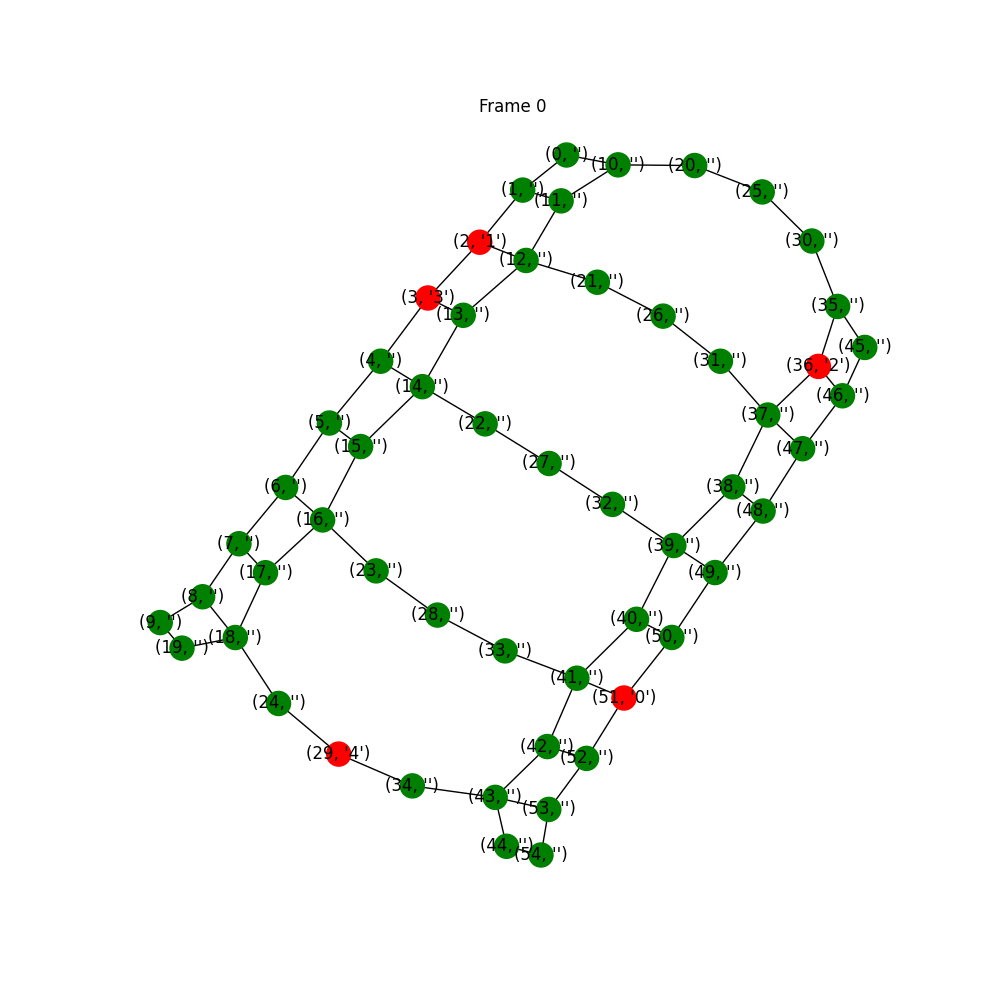

Combinatorial Decision Making and Optimization Course Project.

Solving the Multi-Agent Path Finding (MAPF) problem with Constraint Programming (Docplex) and SAT/SMT (Z3Py).

&nbsp;

###### Abstract
*Multi-Agent Path Finding (MAPF) is a problem with practical implications in several fields: from robotics and self-driving cars to transportation and logistics. The task is to find non-conflicting paths for a set of agents given their starting positions and destinations, usually minimizing a cost function. There are many variations on the classical problem and many approaches have been proposed.
In this work we will focus on SAT and CP-based approaches following the paper of R. Bart&#259;k, J. &#348;vancara and M. Vlk, "A Scheduling-Based Approach to Multi-Agent Path Finding with Weighted and Capacitated Arcs", published in Proceedings of the 17th International Conference on Autonomous Agents and MultiAgent Systems. As the authors suggest, this type of problem lends itself particularly well to be formalized using a compact set of constraints and we found interesting to developed as a project for our Combinatorial Decision Making and Optimization course.*

&nbsp;

### Setup
###### Manual Setup
Using Python 3.7 or lower. The indicated versions are those used during the development.

pip install docplex==2.14.186

pip install z3-solver==4.8.8.0

pip install networkx==2.4

pip install matplotlib==3.2.2

###### Conda environment
conda env create -f environment.yml

&nbsp;
&nbsp;

**To solve locally using Docplex IBM CPLEX® Optimization Studio must be installed on the computer.**
More information on the setup can be found here [Docplex documentation](https://ibmdecisionoptimization.github.io/docplex-doc).

&nbsp;

### Where to start
- solvers/     contains the models in Z3Py and Docplex
- utils/       contains environment.py to handle and generate environments and agents and animations.py to create animations
- resources/   contains some gif animations, the report and the cited paper
- report/      contains the report and bibliography in Latex

&nbsp;

The test files are used to execute different environments. More details are avaiable on the report. Feel free to use and modify the files mapf\_smt.py and mapf\_cp.py to set up personalized experiments using the two approaches separately.

&nbsp;

An example of execution on the warehouse environment

